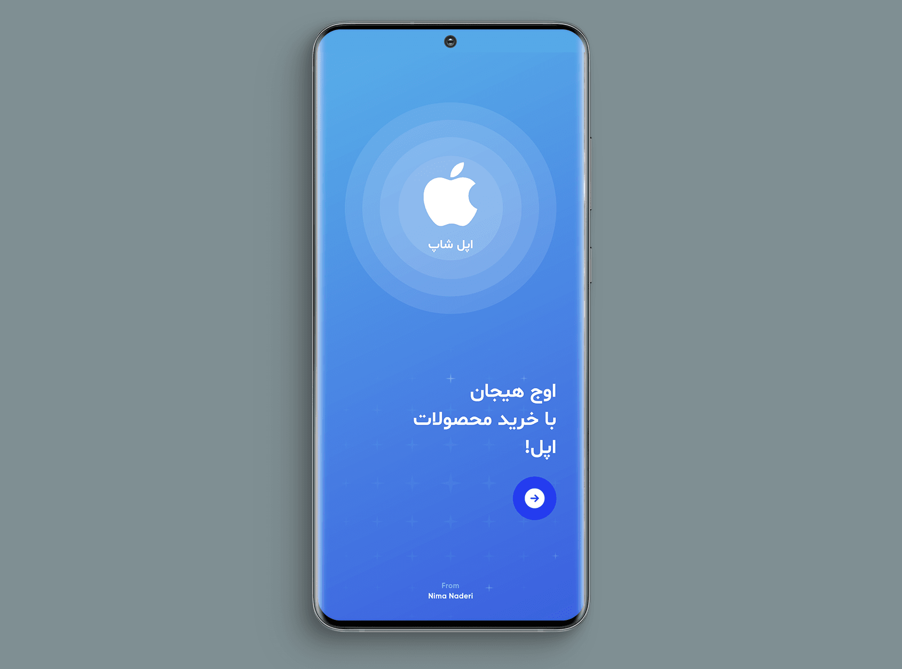
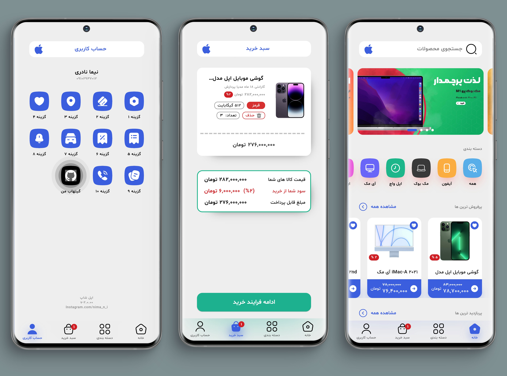
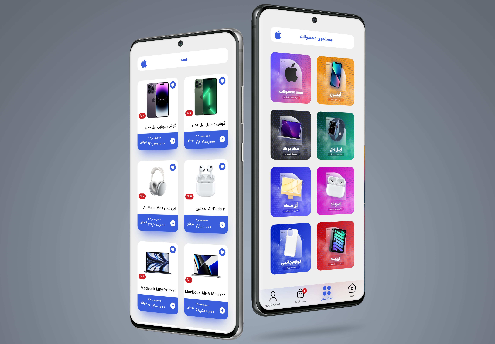
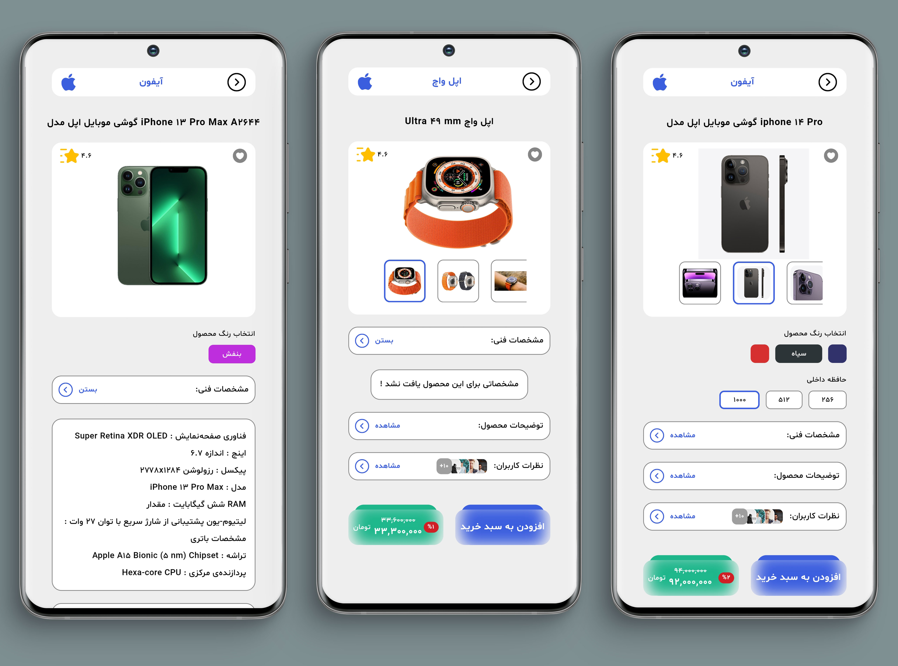

A Shopping Store Project

In this project I focused on logic more than UI ! Because of this UI might be a little simple

# Implemented By =>

Bloc Architecture Pattern
Repository Pattern
Hive Database
Rest API ( Dio )
Dependency Injection ( Get It )
Clean Architecture ( Will Implemented Soon )

# Video Preview

https://github.com/NimaNaderi/apple_shop/assets/96233921/792d2ce7-8a52-4173-a96b-898aea2dc888

# Image Preview

Repository Will Updated As Soon As New Features And Updates Added !
